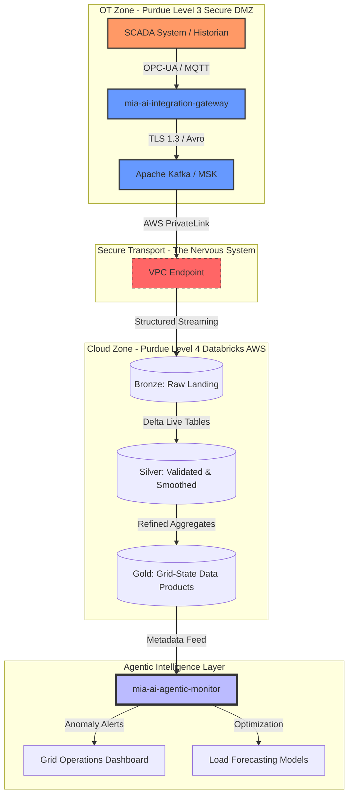

# Mia Ai Volt Streams ⚡
Enterprise "Nervous System" for OT-to-Cloud Data Architecture
Staff-Level Proof of Concept (PoC) | Databricks • AWS • SCADA • Event-Driven AI

## 📋 Executive Summary
Mia Ai Volt Streams is a high-impact architecture blueprint designed for the Utility and Energy sectors. It demonstrates a secure, scalable "Data Nervous System" that ingests high-velocity Operational Technology (OT) data—such as SCADA, PMU, and IoT sensor telemetry—into an AWS-based Databricks Lakehouse.

## The Narrative
> In the utility sector, we cannot simply `query` a database. We must interface with the pulse of the grid itself. This repository demonstrates how I bridge the gap between air-gapped Industrial Historians and Cloud-native Agentic AI. I don't build simple ETL pipelines; I build `Nervous Systems` for the modern power grid.
> — Alf B


This project solves the "Air-Gap Challenge" by providing a governed, automated bridge between high-security industrial zones (Purdue Level 3) and enterprise analytics environments (Purdue Level 4/5), replacing legacy point-to-point integrations with a reusable Data Product framework.
## 🏗 Architectural Pillars
1. The Secure Boundary (AWS PrivateLink)
Navigates complex network constraints by using AWS PrivateLink and VPC Endpoints. This ensures that sensitive grid telemetry moves from the OT DMZ to the Databricks ingestion layer without ever traversing the public internet, maintaining NERC CIP and NIST 800-53 alignment.

---


---

## Medallion Stream Processing (Databricks DLT)
Utilizes Delta Live Tables (DLT) for a robust three-tier data evolution:

🟤 Bronze (Raw): Linear ingestion of SCADA "Tags" (JSON/Avro) with full lineage.

🥈 Silver (Validated): Real-time signal smoothing, handling out-of-order timestamps, and "State-of-Health" validation for sensors.

🥇 Gold (Product): Aggregated "Grid-State" Data Products optimized for AI-driven load balancing and predictive maintenance.

## Agentic Observability
Integrates an AI-Agentic Monitor that uses LLMs to observe stream metadata, alerting on "Sensor Drift" or anomalous patterns in grid topology that traditional threshold-based monitoring might miss.

## 📂 Repository Structure
```PainText
├── api/                # OpenAPI/Proto definitions for the Integration Surface
├── config/schemas/     # Data Contracts (SCADA Tags, Grid Topology)
├── docs/architecture/  # Purdue Model alignment & NIST compliance maps
├── notebooks/          # Databricks DLT Pipelines (PySpark/SQL)
├── pkg/                # Core logic for Resilience, Observability, & OT Protocols
├── services/           # The "Brain" (Integration Gateway & Agentic Monitor)
└── terraform/          # IaC for AWS PrivateLink & Databricks Workspaces

```

---

## 🛠 Technical Stack
| Component | Technology |
| :--- | :--- |
| **Cloud** | AWS (VPC, MSK, S3, Lambda) |
| **Data Platform** | Databricks (Unity Catalog, Delta Live Tables) |
| **Streaming** | Apache Kafka / Amazon MSK |
| **Languages** | Python (PySpark), SQL, HCL (Terraform) |
| **Compliance** | FedRAMP High, NIST 800-53, NERC CIP |


## 🎯 Mission Alignment: The Utility Perspective
In a regulated utility environment, data is only as valuable as it is secure. mia-ai-volt-streams moves beyond simple ETL; it provides the Enterprise Integration Surface required to modernize legacy grid operations into a proactive, AI-ready infrastructure.

## How to Run the End-to-End Test
Now you can open two terminal windows to show off the "Nervous System" in action:

1. **Terminal 1:** Run `make monitor-dev`. The agent will start polling the Gold layer, waiting for data.

2. **Terminal 2:** Run `make mock-failure`.

3. **The Result:** Your Terminal 1 should almost immediately light up with:

> 🚨 ALERT: CRITICAL_THERMAL_ANOMALY - 180.5°F detected in Winter (32.0°F ambient) with low load. Suggesting immediate crew dispatch for oil-level check.
---
## 🚀 Quick Start: Running the Nervous System
Follow these steps to deploy the infrastructure, verify the Fahrenheit logic, and simulate a critical grid failure.

1. Prerequisites
   AWS CLI configured with appropriate permissions.

Terraform (v1.5+) installed.

Python 3.10+ and venv module.

A Databricks Account ID (for the workspace module).

2. Initialization
   Set your Databricks Account ID as an environment variable and initialize the project:
```bash
export TF_VAR_databricks_account_id="your-id-here"
make init
```

## 3. Infrastructure Deployment
Provision the PrivateLink security layer and the Databricks Workspace:

```bash 
make infrastructure
```

## 4. Verification & Testing
Run the automated test suite to validate the 175°F Winter Anomaly logic:

```bash
make test
```

## 5. Live Demo: The "Winter Failure" Scenario
Open two terminal windows to see the Agentic Monitor in action.

* **Terminal A (The Monitor):** Starts the real-time AI observation loop.

```bash
make monitor-dev
```

* **Terminal B (The Injector):** Simulates a 180°F transformer failure in freezing weather.

```bash
make mock-failure
```

## 6. Cleanup
To avoid unnecessary AWS costs after your demo, run the cleanup script:
```bash
bash scripts/cleanup.sh
```

---
🏗 Repository Structure Alignment

| Directory | Component | Responsibility |
| :--- | :--- | :--- |
| api/ | **Contracts** | OpenAPI and Protobuf definitions for OT-to-IT handshakes. |
| config/schemas/ | **Truth** | JSON Schema definitions for SCADA tags and Grid Topology. |
| docs/ | **Knowledge** | Architectural deep dives and Purdue Model alignment docs. |
| notebooks/ | **Pipelines** | Databricks Delta Live Tables (DLT) for Medallion evolution. |
| pkg/ | **Logic** | Shared Python modules for protocol translation and resilience. |
| services/ai-agentic-monitor/ | **The Brain** | LLM-powered observability and Fahrenheit anomaly prompts. |
| services/integration-gateway/ | **The Front Door** | High-throughput API for receiving raw Historian telemetry. |
| services/transformation-worker/ | **The Worker** | Internal logic for Silver-layer mapping and mock-injection. |
| terraform/ | **The Spine** | Automated AWS PrivateLink and Databricks Workspace setup. |


---
## 🌲 Tree directory structure

```
mia-ai-volt-streams/
├── api/                        # Contracts: OpenAPI/Protobuf definitions
│   ├── proto/
│   └── openapi.yaml
├── config/
│   └── schemas/                # Truth: JSON Schema for SCADA/Grid tags
│       ├── grid-topology.json
│       └── scada-tags.json
├── docs/                       # Knowledge: Purdue Model & Arch docs
├── notebooks/                  # Pipelines: Databricks DLT Medallion evolution
│   ├── bronze/
│   ├── silver/
│   └── gold/
├── pkg/                        # Logic: Shared Python modules
│   └── resilience/
├── services/
│   ├── ai-agentic-monitor/     # The Brain: LLM observability & prompts
│   │   ├── prompts/
│   │   └── monitor_logic.py
│   ├── integration-gateway/    # The Front Door: High-throughput API
│   │   └── main.go
│   └── transformation-worker/  # The Worker: Silver-layer & mock-injection
├── terraform/                  # The Spine: AWS PrivateLink & Databricks setup
│   ├── modules/
│   ├── main.tf
│   └── variables.tf
├── .gitignore
└── README.md
```