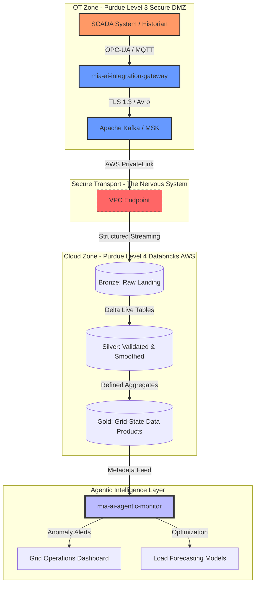

# Mia Ai Volt Streams ⚡
Enterprise "Nervous System" for OT-to-Cloud Data Architecture
Staff-Level Proof of Concept (PoC) | Databricks • AWS • SCADA • Event-Driven AI

## 📋 Executive Summary
Mia Ai Volt Streams is a high-impact architecture blueprint designed for the Utility and Energy sectors. It demonstrates a secure, scalable "Data Nervous System" that ingests high-velocity Operational Technology (OT) data—such as SCADA, PMU, and IoT sensor telemetry—into an AWS-based Databricks Lakehouse.

This project solves the "Air-Gap Challenge" by providing a governed, automated bridge between high-security industrial zones (Purdue Level 3) and enterprise analytics environments (Purdue Level 4/5), replacing legacy point-to-point integrations with a reusable Data Product framework.

## 🏗 Architectural Pillars
1. The Secure Boundary (AWS PrivateLink)
Navigates complex network constraints by using AWS PrivateLink and VPC Endpoints. This ensures that sensitive grid telemetry moves from the OT DMZ to the Databricks ingestion layer without ever traversing the public internet, maintaining NERC CIP and NIST 800-53 alignment.

---

---

## Medallion Stream Processing (Databricks DLT)
Utilizes Delta Live Tables (DLT) for a robust three-tier data evolution:

🟤 Bronze (Raw): Linear ingestion of SCADA "Tags" (JSON/Avro) with full lineage.

🥈 Silver (Validated): Real-time signal smoothing, handling out-of-order timestamps, and "State-of-Health" validation for sensors.

🥇 Gold (Product): Aggregated "Grid-State" Data Products optimized for AI-driven load balancing and predictive maintenance.

## Agentic Observability
Integrates an AI-Agentic Monitor that uses LLMs to observe stream metadata, alerting on "Sensor Drift" or anomalous patterns in grid topology that traditional threshold-based monitoring might miss.

## 📂 Repository Structure

Plaintext
├── api/                # OpenAPI/Proto definitions for the Integration Surface
├── config/schemas/     # Data Contracts (SCADA Tags, Grid Topology)
├── docs/architecture/  # Purdue Model alignment & NIST compliance maps
├── notebooks/          # Databricks DLT Pipelines (PySpark/SQL)
├── pkg/                # Core logic for Resilience, Observability, & OT Protocols
├── services/           # The "Brain" (Integration Gateway & Agentic Monitor)
└── terraform/          # IaC for AWS PrivateLink & Databricks Workspaces

---

## 🛠 Technical Stack

| Component | Technology |
| :--- | :--- |
| **Cloud** | AWS (VPC, MSK, S3, Lambda) |
| **Data Platform** | Databricks (Unity Catalog, Delta Live Tables) |
| **Streaming** | Apache Kafka / Amazon MSK |
| **Languages** | Python (PySpark), SQL, HCL (Terraform) |
| **Compliance** | FedRAMP High, NIST 800-53, NERC CIP |

## 🎯 Mission Alignment: The Utility Perspective
In a regulated utility environment, data is only as valuable as it is secure. mia-ai-volt-streams moves beyond simple ETL; it provides the Enterprise Integration Surface required to modernize legacy grid operations into a proactive, AI-ready infrastructure.

