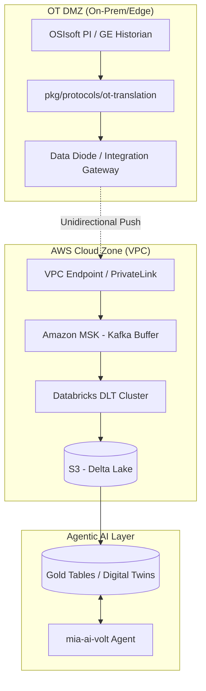

# Technical Deep Dive: mia-ai-volt-streams ⚡
Author: Alf Baez, Sr. Data Architect 

**Focus:** OT-to-IT Data Integration & Grid Intelligence

### The Narrative
> In the utility sector, we cannot simply `query` a database. We must interface with the pulse of the grid itself. This repository demonstrates how I bridge the gap between air-gapped Industrial Historians and Cloud-native Agentic AI. I don't build simple ETL pipelines; I build `Nervous Systems` for the modern power grid.
> — Alf
---

## 1. The Architecture (The "How")
   In thed utility sector, we cannot simply `query` a database. We must interface with Historians (OSIsoft PI, GE Digital) or directly with Gateways via industrial protocols.

* **Protocol Translation:** The `pkg/protocols/ot-translation` layer is designed to bridge **OPC-UA** and **DNP3** into structured Avro/JSON.

* **Backpressure Handling:** Using Amazon MSK (Managed Streaming for Kafka) as the buffer. This ensures that if the Databricks cluster scales or restarts, no critical grid "Tags" are lost in transit.

* **Schema Enforcement:** Leveraging the Confluent Schema Registry to ensure that any change in sensor firmware doesn't break downstream Bronze-layer tables.

* **Security Air-Gap:** A simulated **Data Diode** pattern using AWS PrivateLink and VPC Endpoints for unidirectional, outbound-only data flow.
---
## 🏗 Architecture

---

## 2. Security Posture: Navigating the Air-Gap
   The primary challenge in this requirement is "secure network boundaries."

* **Unidirectional Data Flow:** We simulate a "Data Diode" pattern where the integration-gateway in the OT DMZ can push to the Cloud Zone, but the Cloud Zone has zero inbound access to the OT environment.

* **AWS PrivateLink:** By using VPC Endpoints, we keep all traffic on the Amazon backbone. This mitigates the risk of Man-in-the-Middle (MitM) attacks on sensitive grid telemetry.

* **Encryption:** Data is encrypted using AWS KMS customer-managed keys (CMK) both at rest in S3 (Delta Lake) and in transit (TLS 1.3).
---
## 3. The Medallion Evolution (Databricks DLT)

We move beyond simple ETL to a **Stateful Evolution** of data. By leveraging Delta Live Tables (DLT), we ensure data integrity and high-performance retrieval across three distinct layers:

| Layer | Type | Purpose & Data Treatment | Key Technical Features |
| :--- | :--- | :--- | :--- |
| **Bronze** | **Raw** | Append-only store of every sensor ping. Acts as the single source of truth. | **NERC CIP Auditability:** Immutable logs for regulatory compliance. |
| **Silver** | **Curated** | The "Brain" of the architecture. Data is cleaned, filtered, and normalized. | **Watermarking:** Handles late-arriving data; **Z-Order Indexing:** Optimized for `tag_name` and `timestamp`. |
| **Gold** | **Aggregated** | Business-level "Digital Twins" of assets (e.g., Transformers, Feeders). | **AI-Ready:** Optimized for BI tools and **Agentic AI** load-forecasting models. |

> [!NOTE]
> This architecture ensures that our **Digital Twin** entities are always synchronized with the latest field telemetry while maintaining a full audit trail in the Bronze layer.
---

## 4. Agentic Observability (The Future State)
   
Traditional monitoring uses static thresholds (e.g., "Alert if Temp > 175°F"). **mia-ai-volt-streams** introduces **Agentic AI** Monitoring:

* **Contextual Analysis:** The agent understands that **175°F** is normal during a summer peak but anomalous at **3 AM** in winter.

* **Automated Root Cause:** If multiple sensors in a specific **Grid Topology** fail simultaneously, the agent can correlate the events to a specific circuit breaker trip before a human operator sees the alarm.